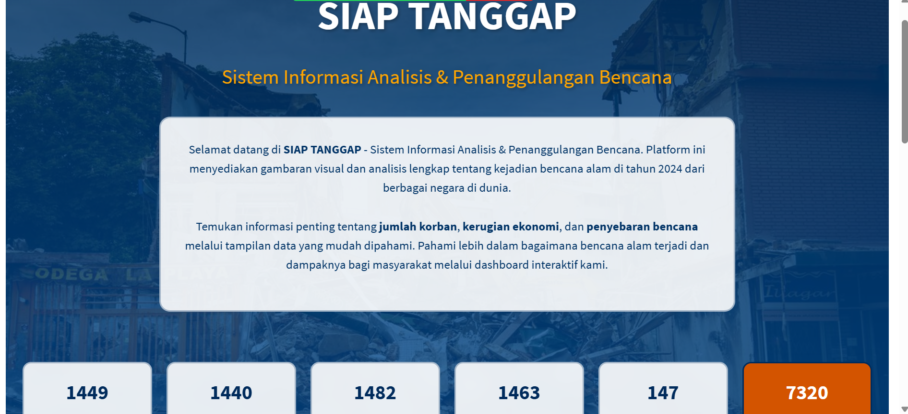

<p align="center">
  
</p>

<div align="center">

#  SIAP TANGGAP: Sistem Informasi Analisis & Penanggulangan Bencana

[Tentang](#notebook-tentang)
•
[Dashboard Database](#desktop_computer-dashboard-database)
•
[Demo](#octocat-demo)

</div>

## :bookmark_tabs: Menu

- [Tentang](#notebook-tentang)
- [INFO](#bookmark_tabs-INFO)
- [Dashboard Database](#desktop_computer-dashboard-database)
- [Demo](#octocat-demo)
- [Requirements](#exclamation-requirements)
- [Deskripsi Data](#postbox-deskripsi-data)
- [Struktur Folder](#open_file_folder-struktur-folder)
- [Tim Pengembang](#ninja-tim-pengembang)


## :notebook: Tentang
<div align="justify">
Selamat datang di SIAP TANGGAP - Sistem Informasi Analisis & Penanggulangan Bencana. Platform ini menyediakan gambaran visual dan analisis lengkap tentang kejadian bencana alam di tahun 2024 dari berbagai negara di dunia.

Temukan informasi penting tentang jumlah korban, kerugian ekonomi, dan penyebaran bencana melalui tampilan data yang mudah dipahami. Pahami lebih dalam bagaimana bencana alam terjadi dan dampaknya bagi masyarakat melalui dashboard interaktif kami.

### :bookmark_tabs: INFO
**Ikhtisar**

Dashboard ini menyajikan analisis komprehensif data bencana alam tahun 2024, dengan fokus pada visualisasi interaktif dari berbagai jenis bencana seperti banjir, gempa bumi, tornado, badai, dan kebakaran hutan. Data dikategorikan berdasarkan wilayah, periode waktu, dan dampak, mencakup informasi tentang korban jiwa dan kerugian ekonomi. Dilengkapi dengan fitur penyaringan canggih, grafik dinamis, dan peta interaktif, dashboard ini memungkinkan pengguna untuk mengeksplorasi pola, tren, dan tingkat keparahan bencana secara mendalam.

**Metodologi**

**1. Analisis Statistik Deskriptif**

- Ukuran Pemusatan: Mean, median, dan modus untuk mengidentifikasi nilai tipikal
- Ukuran Penyebaran: Standar deviasi, range, dan IQR untuk mengukur variabilitas
- Distribusi: Analisis skewness dan kurtosis untuk memahami bentuk distribusi data
- Visualisasi: Histogram, box plot, dan violin plot untuk representasi visual distribusi

**2. Analisis Korelasi**

- Korelasi Pearson: Mengukur kekuatan hubungan linear antar variabel numerik
- Heatmap Korelasi: Visualisasi matriks korelasi untuk memudahkan interpretasi
- Analisis Multivariat: Mengeksplorasi hubungan kompleks antar multiple variabel

**3. Analisis Regresi**

- Regresi Linear: Memodelkan hubungan linear antara variabel dependen dan independen
- Evaluasi Model: Menggunakan R², RMSE, dan p-value untuk menilai kualitas model
- Diagnostik Model: Analisis residual dan uji asumsi untuk validasi model

**4. Analisis Time Series & Peramalan**

- ARIMA: Model untuk menganalisis dan meramalkan data time series dengan mempertimbangkan autoregressive dan moving average components
- Exponential Smoothing (ETS): Metode peramalan yang memberikan bobot lebih besar pada observasi terbaru
- Simple Moving Average (SMA): Teknik smoothing sederhana untuk mengidentifikasi tren
- Evaluasi Forecast: Menggunakan metrik RMSE, MAE, dan MAPE untuk menilai akurasi peramalan


## :desktop_computer: Dashboard Database

Berikut merupakan tampilan awal dari dasboard SIAP TANGGAP - Sistem Informasi Analisis & Penanggulangan Bencana 
<p align="center">
  
</p>

## :octocat: Demo

Berikut merupakan link untuk shinnyapps atau dashboard dari project kami:
[https://dvprmta.shinyapps.io/Disaster_Dashboard/](https://dvprmta.shinyapps.io/Dashboard_EVD/)

## :exclamation: Requirements
Dashboard menggunakan `shinny`, `shinnythemes`, `bs4Dash`, `DT`, dan `dplyr` dari package R

## :postbox: Deskripsi Data
- Dataset mencakup informasi dari enam negara: Brasil, China, India, Indonesia, Jepang, dan Amerika Serikat
- Periode data: Januari 2024 hingga Oktober 2024
- Total entri: 7.320 records

**Variabel yang dicakup:**

- Jenis bencana (kebakaran hutan, angin topan, tornado, banjir, gempa bumi)
- Lokasi dan waktu kejadian
- Jumlah korban jiwa
- Estimasi kerugian ekonomi
- Magnitudo atau intensitas bencana

**Sumber**

Data diperoleh dari [Kaggle - Prediction of Disaster Management in 2024](https://www.kaggle.com/datasets/umeradnaan/prediction-of-disaster-management-in-2024). Dataset ini telah melalui proses pembersihan dan validasi untuk memastikan kualitas dan konsistensi analisis.

## :open_file_folder: Struktur Folder

```
.
├── app           # ShinyApps
│   ├── server.R
│   └── ui.R
│
├── data 
│   ├── natural_disasters_2024.csv
│
├── image
│   ├── dashboard.png
│   ├──	peta.png
| 
└── README.md
```


## :computer: Tim Pengembang
+ Database Manager : [Adhiyatma Nugraha](https://github.com/adhiyatmanugraha) (G1501231085)
+ UI/UX Developer : [Devi Permata Sari](https://github.com/dvprmta) (G1501231026)
+ Technical Writer : [Tukhfatur Rizmah A.](https://github.com/tukhfaturr) (G1501231023)
